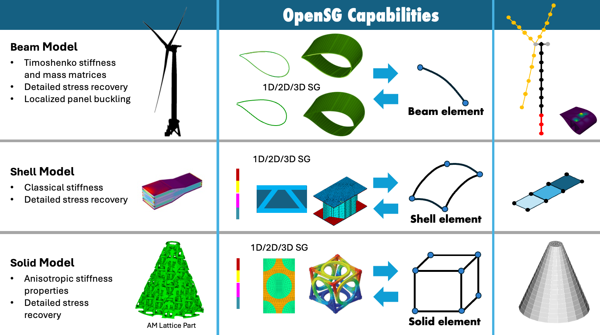

# OpenSG: Multiscale Structural Analysis using FEniCS

This repository houses OpenSG, a Python module built for performing multiscale structural analysis using Python. It is an open-source implementation of the Mechanics of Structure Genome (MSG) with FEniCS. It contains core objects to obtain the structural homogenized properties in terms of either of Cauchy continuum (3D) model, plate/shell model or beam model. It also has the capability to generate local stress and displacement field (dehomogenization) of the structure based on input loads from other analysis software.



## Part of the WETO Stack
OpenSG is primarily developed with the support of the U.S. Department of Energy and is part of the [WETO Software Stack](https://nrel.github.io/WETOStack). For more information and other integrated modeling software, see:
- [Portfolio Overview](https://nrel.github.io/WETOStack/portfolio_analysis/overview.html)
- [Entry Guide](https://nrel.github.io/WETOStack/_static/entry_guide/index.html)

## Installation

```bash
git clone https://github.com/wenbinyugroup/OpenSG.git
cd OpenSG
conda env create --file environment.yml
conda activate opensg_env
```
## Support

For support and questions, please:
- Check the [documentation](https://wenbinyugroup.github.io/OpenSG/)
- Open an [issue](https://github.com/wenbinyugroup/OpenSG/issues)
- Join our [discussion forum](https://github.com/wenbinyugroup/OpenSG/discussions)

## Package Structure

```
opensg/
├── core/           # Core computation modules
│   ├── __init__.py
│   ├── shell.py    # Shell element computations and ABD matrices
│   ├── solid.py    # Solid element computations
│   └── stress_recov.py # Stress recovery utilities
├── mesh/           # Mesh handling
│   ├── __init__.py
│   ├── blade.py    # Deprecated classes for mesh management.
│   └── segment.py  # ShellSegmentMesh and SolidSegmentMesh classes for mesh management
├── io/             # Input/output operations
│   ├── __init__.py
│   ├── io.py       # File I/O functions (YAML, mesh files)
│   └── util.py     # I/O utility functions
├── utils/          # Utility functions
│   ├── __init__.py
│   ├── eigenvalue_solver.py # Eigenvalue solver utilities
│   ├── shared.py   # Shared utilities (nullspace, solvers, constraints)
│   ├── shell.py    # Shell-specific utilities
│   └── solid.py    # Solid-specific utilities
├── tests/          # Test suite
```

## License

This project is licensed under the MIT License - see the [LICENSE](LICENSE) file for details.

### Sandia Funding Statement

Sandia National Laboratories is a multimission laboratory managed and operated by National Technology and Engineering Solutions of Sandia, LLC., a wholly owned subsidiary of Honeywell International, Inc., for the U.S. Department of Energy's National Nuclear Security Administration under contract DE-NA-0003525.

## Citation

TBD
