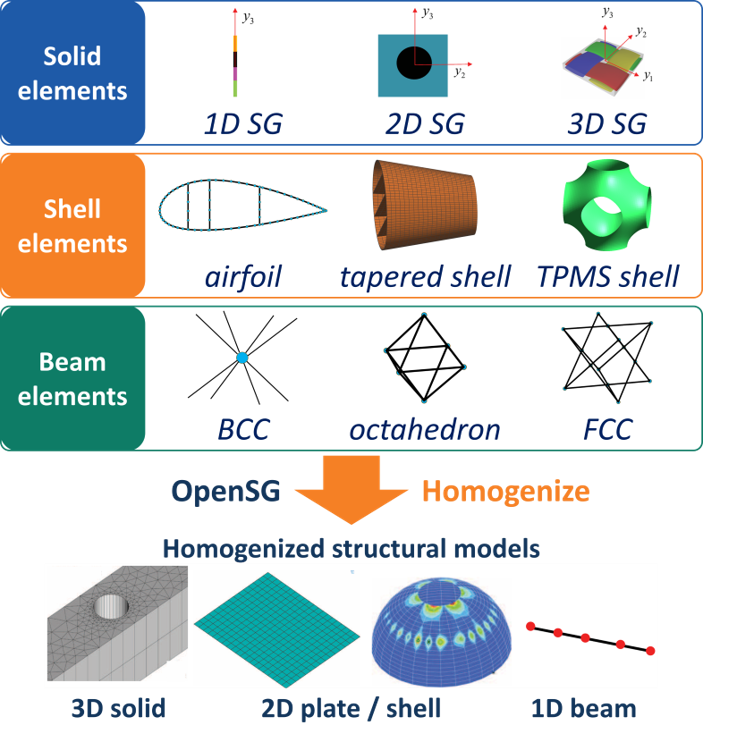

# FEA in JAX

`fea-in-jax` is a Finite Element Analysis (FEA) library written in JAX. It leverages JAX's composable function transformations—JIT compilation, automatic differentiation, and vectorization—to provide a high-performance solver capable of running on GPUs and TPUs.

## OpenSG: multiscale structural mechanics

<p align="center"></p>

OpenSG is the multiscale structural-mechanics capability of `fea-in-jax`, built on the Mechanics of Structure Genome (MSG). It uses a Structure Gene (SG) to obtain the constitutive relations of solid, plate/shell and beam models, and it performs dehomogenization to recover the local stresses from the structural response.

**Structure Gene (SG):** heterogeneity and anisotropy come from a Structure Gene, meshed with solid elements as a 1D, 2D or 3D SG. An SG can be built from solid, shell and beam elements.

### Installing OpenSG

OpenSG needs one conda-packaged dependency block (the FEniCSx `basix` basis and quadrature stack) on top of the JAX stack. The repository ships an `environment.yml` that installs everything, including the repository itself in editable mode:

```bash
git clone -b akshat/opensg https://github.com/KeithBallard/fea-in-jax.git
cd fea-in-jax
conda env create -f environment.yml
conda activate opensg
```

Run OpenSG from the command line, one command for both engines:

```text
opensg <sg.yaml>            homogenization (the default)
opensg <sg.yaml> D          dehomogenization: homogenize, then recover the local fields
opensg <sg.yaml> --center   shell SG only: the contour is the laminate mid-surface instead of the outer mold line
```

A homogenization writes `<base>.out` with the effective stiffness and compliance matrices of the macro model. A dehomogenization also writes the local stress, strain and displacement in the material frame as `<base>.SM`, `<base>.EM` and `<base>.U`, and `<base>.vtk` to visualize their distribution.

Meshes from other tools convert to the yaml with `opensg inp_to_yaml <file.inp> --n_model {1,2,3}` (Abaqus) and `opensg msh_to_yaml <file.msh> --mat1 NAME --n_model {1,2,3}` (gmsh); `opensg --help` lists the flags.

### OpenSG yaml input

One yaml per Structure Gene: a short header, then the mesh. Each engine reads its own dialect:

<table>
<tr><th>SG of shell elements</th><th>SG of solid elements</th></tr>
<tr><td><pre>
msg: shell
n_model: 1          # 1 beam, 2 plate, 3 solid
refined: 1          # 0 classical, 1 shear-refined
nodes:              # node coordinates
elements:           # element connectivity
sets:               # element sets, one per layup
sections:           # one per element set
  - elementSet: layup_0
    layup:          # [material, thickness, angle] per ply
      - [glass_triax, 0.003, 0.0]
      - [glass_uniax, 0.026, 0.0]
elementOrientations:  # material frame per element
materials:          # engineering constants by name
</pre></td>
<td><pre>
msg: solid
n_model: 2          # 1 beam, 2 plate, 3 solid
refined: 1          # 0 classical, 1 shear-refined
nodes:              # node coordinates
cells:              # element connectivity
mat_id:             # material id per element
materials:          # by id
  1:
    type: 1         # engineering constants
    engineering: [E1, E2, E3, G12, G13, G23, nu12, nu13, nu23]
    angle: 45.0     # ply angle
</pre></td></tr>
</table>

The SG dimension (1D, 2D or 3D) is read from the mesh. Key-by-key reference and worked files: [docs/input_format.md](docs/input_format.md). Examples: `examples/OpenSG-solid` and `examples/OpenSG_shell`. Install details: [docs/installation.md](docs/installation.md).

## Features

*   **GPU Acceleration**: Native support for hardware acceleration via JAX.
*   **Differentiability**: Differentiate through the physics simulation for gradient-based optimization and machine learning integration.
*   **Batched Computation**: Designed to efficiently handle large batches of elements and quadrature points.

## Project Structure

*   `src/fe_jax`: Core library source code, including element definitions, quadrature rules, and solver implementations.
*   `tests`: extensive test suite that also serves as a catalogue of usage examples.
*   `docs`: Documentation and theoretical background.

## Getting Started

### Prerequisites

*   Python 3.10+
*   [CUDA Toolkit](https://developer.nvidia.com/cuda-toolkit) (optional, strictly for GPU acceleration)

### Installation

1.  **Clone the repository:**
    ```bash
    git clone <repository_url>
    cd fea-in-jax
    ```

2.  **Set up a virtual environment (recommended):**
    ```bash
    python -m venv .venv
    source .venv/bin/activate  # On Windows: .venv\Scripts\activate
    ```

3.  **Install dependencies:**
    ```bash
    pip install -r requirements.txt
    ```
    *Note: `jax` installation instructions vary depending on your hardware (CPU, GPU, TPU). Please refer to the [JAX installation guide](https://github.com/google/jax#installation) if the default pip install does not match your system configuration.*

    For development, install the package in editable mode with the test dependency:
    ```bash
    pip install -e ".[dev]"
    ```

4.  **(Optional) Install `pyamgx`:**
    To enable GPU-accelerated algebraic multigrid preconditioners:
    1.  Install NVIDIA's [AMGX](https://github.com/NVIDIA/AMGX?tab=readme-ov-file#quickstart).
    2.  Install [pyamgx](https://pyamgx.readthedocs.io/en/latest/install.html).

## Running Tests

To verify the installation and run the test suite:

```bash
pytest tests
```

## Usage

The `tests` directory contains numerous examples demonstrating how to define meshes, apply boundary conditions, and solve boundary value problems.

*   **Basic Linear Elasticity**: See `tests/test_simple_fea_solve.py` for a straightforward example.
*   **Complex Scenarios**: See `tests/test_fea_solve.py`.

## Theory and Implementation

For detailed information on the nonlinear solver derivation, handling of Dirichlet boundary conditions, and internal variable definitions, please refer to [docs/theory.md](docs/theory.md).

## Resources

*   **JAX Interoperability**: [External Callbacks](https://apxml.com/courses/advanced-jax/chapter-5-jax-interoperability-custom-operations/using-jax-pure-callback)
*   **Scientific Computing in JAX**:
    *   [Wrapping Scipy KD trees](https://robertdyro.com/articles/jax_advanced/)
    *   [HPC Lecture Notes](https://tbetcke.github.io/hpc_lecture_notes/intro.html)
*   **Performance Optimization**:
    *   [JAX GPU Performance Tips](https://jax.readthedocs.io/en/latest/gpu_performance_tips.html)
    *   [JAX AOT Compilation](https://jax.readthedocs.io/en/latest/aot.html)
    *   [Multi-Process/Distributed Support](https://jax.readthedocs.io/en/latest/gpu_performance_tips.html#multi-process)

### Profiling Performance

*   [JAX Profiling Docs](https://jax.readthedocs.io/en/latest/profiling.html)
*   [NVIDIA JAX Toolbox](https://github.com/NVIDIA/JAX-Toolbox/blob/main/docs/profiling.md)
*   [NSys-JAX Wrapper](https://github.com/NVIDIA/JAX-Toolbox/blob/main/docs/nsys-jax.md)
*   [JAX Device Memory Profiling](https://jax.readthedocs.io/en/latest/device_memory_profiling.html)
*   [jax-smi (GPU Memory Tracking)](https://github.com/ayaka14732/jax-smi)

To profile time and memory for JIT-compiled sections:
1.  Collect trace: `jax.profiler.start_trace("<directory>/prof")`
2.  Visualize: using TensorBoard or `xprof`.

## Public Release Information

Distribution Statement A. Approved for public release: distribution is unlimited. Case #: AFRL-2025-4644
